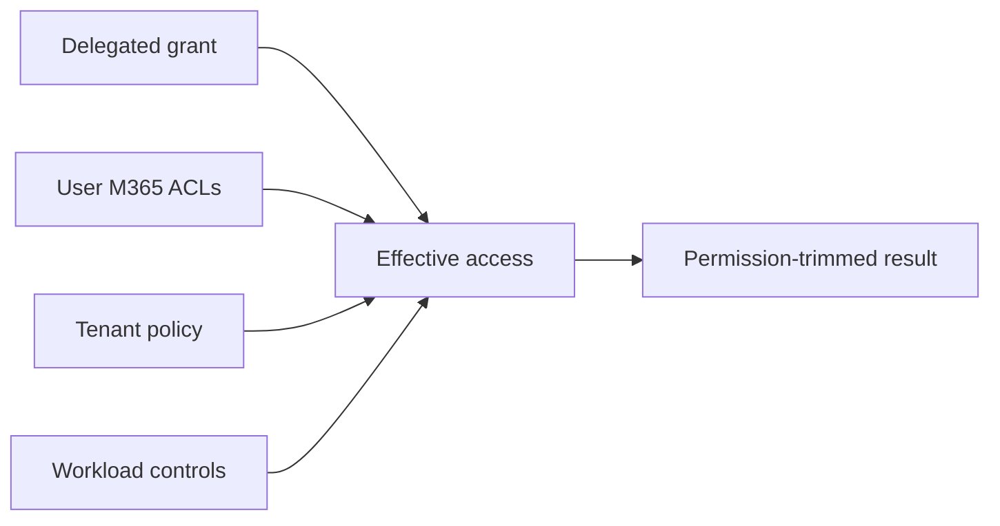

# Authentication and delegated access

All three surfaces operate as a signed-in user and use the same published WorkIQ resource and
delegated scope. Protocol choice changes token acquisition and presentation, not the Microsoft 365
authorization boundary.

```text
Resource  api://workiq.svc.cloud.microsoft
Scope     api://workiq.svc.cloud.microsoft/WorkIQAgent.Ask
```

The resource is the token audience; the scope is the delegated permission. Check them separately
when diagnosing authorization failures. `WorkIQAgent.Ask` requires admin consent and has no
published application-permission equivalent. Consent permits the WorkIQ call, but user ACLs and
tenant, path, method, and workload policy still decide what that call may do.

## Effective access



A delegated grant cannot elevate the user beyond their Microsoft 365 access. Licensing,
sensitivity labels, information barriers, and workload policy still apply.

## Client patterns

| Topology | Flow | Token presenter |
| --- | --- | --- |
| MCP over local stdio | WorkIQ CLI interactive auth | WorkIQ child process |
| Remote MCP | OAuth discovery + PKCE or OBO | MCP client |
| Local A2A or REST | Public client + authorization code with PKCE | Caller |
| Hosted A2A or REST | Confidential backend + OBO | Backend |

### Public client

Use authorization code with PKCE through the system browser or broker. A CLI is a public client and
must not contain a client secret. Cache tokens through the identity library and key state by tenant
and user.

### Hosted backend

Use OBO to exchange a user token issued for the backend API for a delegated WorkIQ token. The
backend authenticates with a certificate, federated credential, or secret; the downstream token
still represents the user.

### Local MCP

This project starts `npx -y @microsoft/workiq mcp` over stdio. The child owns sign-in, token caching,
refresh, and reauthentication. Python controls which discovered tools reach the model but does not
handle the WorkIQ bearer token.

For remote MCP, discover authorization from the protected-resource and authorization-server
metadata instead of hard-coding an OAuth server or assuming consent authorizes every path or method.

## Security invariants

- Scope conversation, context, and task IDs by tenant and user.
- Treat IDs as routing state, never authorization.
- Keep tokens, tool payloads, grounded text, and unrestricted reference URLs out of logs.
- Require a fresh authorized call whenever state is reused.
- Gate MCP mutations with both tenant policy and local user confirmation.

## Fast diagnosis

| Symptom | Check first |
| --- | --- |
| `401` | Audience, issuer, expiry, tenant, and client ID |
| Consent failure | Admin consent for the exact registration and scope |
| `403` | Scope, user ACL, tenant policy, license, and workload restrictions |
| Empty result | User access to the source in Microsoft 365 |
| MCP read succeeds, mutation fails | Path/method policy and local allowlist |
| Stored ID fails | Current authorization, identity ownership, then retention |
