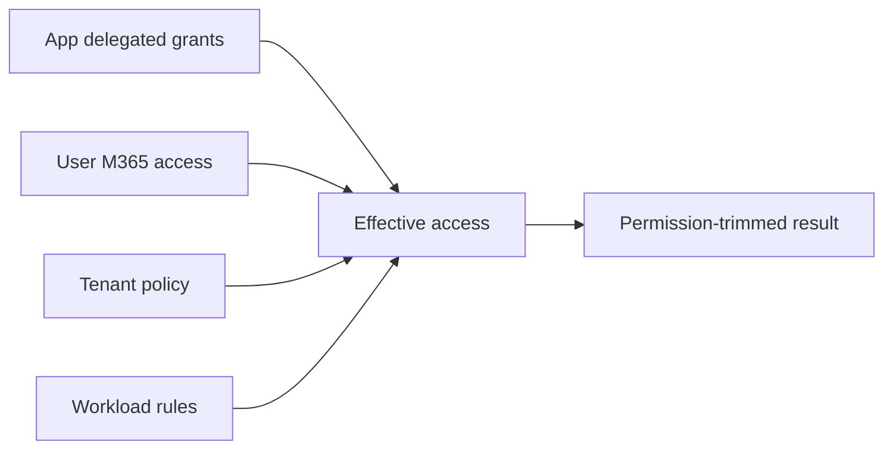
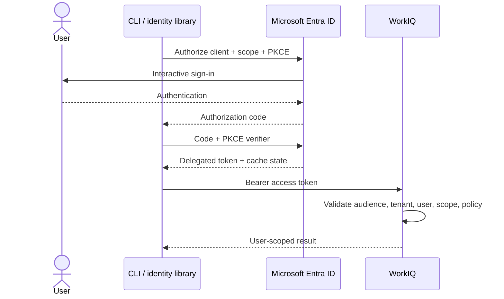
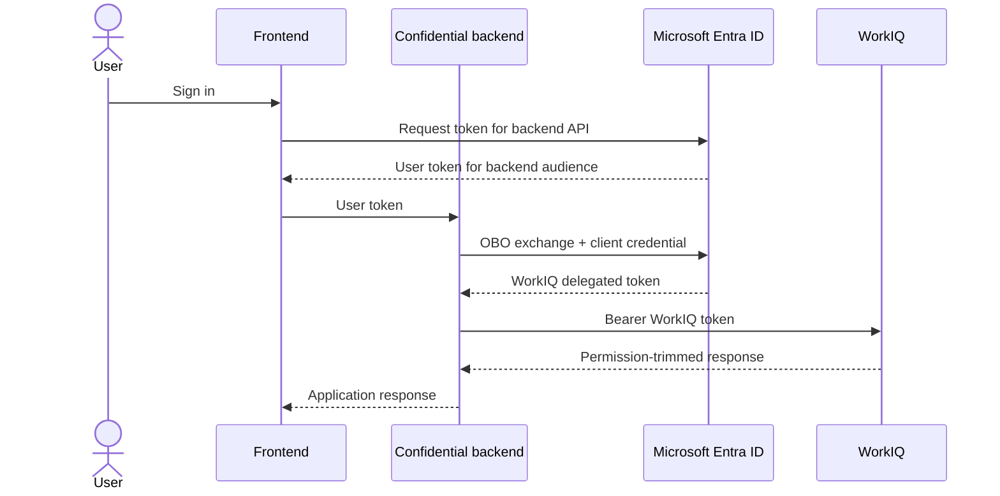

# Authentication and delegated access

All three WorkIQ surfaces ultimately operate in a signed-in user's context. The protocol changes
how a token is acquired and presented; it does not change whose Microsoft 365 permissions are
enforced.



Licensing, billing, and connector entitlements can add further gates. A delegated permission never
grants the user content they could not otherwise access. WorkIQ still applies Microsoft 365 ACLs,
sensitivity labels, information barriers, and tenant controls. [[S1]](evidence.md#s1)
[[S2]](evidence.md#s2) [[S10]](evidence.md#s10)

## Audience and scope are different

```text
Resource identifier  api://workiq.svc.cloud.microsoft
Delegated scope      api://workiq.svc.cloud.microsoft/WorkIQAgent.Ask
```

| OAuth concept | WorkIQ value | What to inspect |
| --- | --- | --- |
| Protected resource | `api://workiq.svc.cloud.microsoft` | Token `aud` claim |
| Delegated permission | `WorkIQAgent.Ask` | Delegated scope claim |
| Full requested scope | `api://workiq.svc.cloud.microsoft/WorkIQAgent.Ask` | Authorization request |

Do not configure the full scope string as the resource identifier. Diagnose `401` and `403`
responses by checking audience and delegated scope separately.

The current permission reference marks `WorkIQAgent.Ask` as delegated, requires tenant admin
consent, and lists no application-permission equivalent. [[S10]](evidence.md#s10)

!!! warning "Scope boundary for MCP"
    `WorkIQAgent.Ask` is documented for direct agent conversations. The cited public permission
    reference does not prove that it grants every MCP entity and schema operation. Remote MCP
    clients should discover applicable scopes from WorkIQ protected-resource metadata and test
    read, schema, binary, and mutation categories with the approved registration.

## Local CLI: public client + PKCE

A user-run macOS CLI should be an Entra **public client** using authorization code with PKCE through
the system browser or broker. A public client must not contain a client secret.



The WorkIQ A2A quickstart uses a single-tenant public-client registration, enables public client
flows, configures native/loopback redirect URIs, and uses interactive browser authentication on
macOS and Linux. [[S6]](evidence.md#s6)

Validate these token properties before debugging the protocol payload:

- `aud` identifies `api://workiq.svc.cloud.microsoft`;
- delegated scopes contain the required WorkIQ permission;
- tenant and user claims match the intended directory and person;
- the registered application's client ID received the token.

An arbitrary Azure CLI token is not a substitute for a token issued to the application's
registered client. [[S6]](evidence.md#s6)

## Hosted application: On-Behalf-Of

A backend should not start an interactive public-client flow for every WorkIQ call. Use OAuth
On-Behalf-Of (OBO) to exchange the frontend's user assertion for a WorkIQ delegated token.



The backend proves both an authenticated user assertion and its own confidential-client identity
through a certificate, federated credential, or secret. The resulting WorkIQ token still
represents the user; it is not app-only access. WorkIQ's A2A quickstart explicitly recommends OBO
for server-side agents acting for end users. [[S6]](evidence.md#s6)

## Protocol authentication matrix

| Surface | Local application | Hosted application | Who presents the WorkIQ token? |
| --- | --- | --- | --- |
| MCP over local stdio | `@microsoft/workiq` owns interactive auth | Not this topology | WorkIQ child process |
| Remote MCP | OAuth discovery + public-client flow | OAuth discovery + OBO where supported | MCP client |
| A2A | Public client + PKCE / broker | Confidential client + OBO | A2A caller |
| REST | Public client + PKCE / broker | Confidential client + OBO | REST caller |

### Local MCP is intentionally different

This project starts `npx -y @microsoft/workiq mcp` and talks to it over stdio. MCP does not define an
OAuth transport flow for stdio, so credentials are environment- or implementation-owned.
[[P1]](evidence.md#p1) The child process authenticates the signed-in user and keeps the bearer token
outside the Python process. [[R1]](evidence.md#r1) [[R4]](evidence.md#r4)

Security consequences:

- the WorkIQ CLI owns token acquisition, caching, refresh, and reauthentication;
- the child inherits the local execution environment;
- stdout stays reserved for JSON-RPC and logs go to stderr;
- the Python app still decides which discovered tools reach the model;
- WorkIQ still enforces tenant and user permissions server-side.

Do not build application logic against undocumented WorkIQ CLI token-cache internals.

### Remote MCP discovers authorization

For remote HTTP MCP, the protocol defines protected-resource discovery:

1. Read `/.well-known/oauth-protected-resource`.
2. Locate the authorization server.
3. Read OAuth/OIDC metadata.
4. Perform OAuth 2.1 authorization.
5. Request a resource-bound token.
6. Present it to the MCP resource server.

WorkIQ says compatible MCP clients automatically discover its Entra configuration through this
metadata. [[P1]](evidence.md#p1) [[S1]](evidence.md#s1)

## State is not authorization

Conversation and task identifiers are routing/state handles, never credentials:

| Identifier | Scope it by | Still required on reuse |
| --- | --- | --- |
| MCP `ask` `conversationId` | Tenant + user + outer thread | Authorized MCP call |
| A2A `contextId` | Tenant + user + workflow | WorkIQ bearer token |
| A2A `task.id` | Tenant + user + workflow | WorkIQ bearer token |
| REST `conversationId` | Tenant + user + chat | WorkIQ bearer token |

Possession of an ID does not grant access to its underlying content.

## Delegation changes operations

- Key caches by tenant and user; identical prompts do not make results shareable.
- Store conversation, context, and task IDs within that same identity boundary.
- Keep tokens, tool payloads, grounded text, and unrestricted citation URLs out of logs.
- Refresh or reacquire delegated tokens correctly; background work cannot silently outlive its auth
  and task constraints.
- Admin consent enables the app's delegated capability tenant-wide, but never bypasses each user's
  Microsoft 365 ACLs.

## Diagnose auth failures

| Symptom | First discriminating check |
| --- | --- |
| `401 Unauthorized` | Decode token metadata and verify WorkIQ `aud`, issuer, expiry, and client ID |
| Consent prompt or consent failure | Confirm tenant admin granted the delegated permission to this registration |
| `403 Forbidden` | Separate missing scope from user ACL, tenant policy, license, and workload restrictions |
| Empty grounded result | Verify the signed-in user can open the source directly in Microsoft 365 |
| MCP read works but mutation fails | Check WorkIQ path/method policy; writes are blocked by default |
| Task or conversation ID stops working | Reauthorize first, then verify server retention and identity ownership |