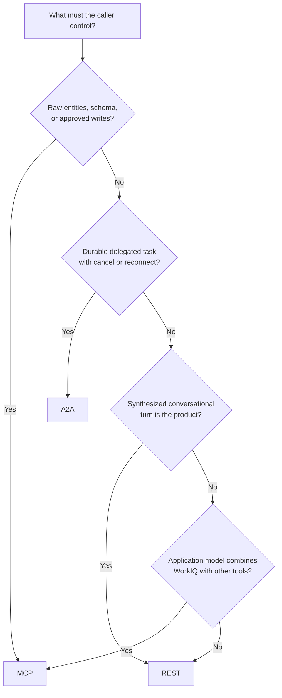

# Choose and implement

Protocol selection should follow the unit of work and its owner. Start with the first requirement
that creates a hard boundary; do not average feature scores across fundamentally different
contracts.



## Requirement-to-contract map

| Requirement | Best fit | Deciding reason |
| --- | --- | --- |
| Let `gpt-5.6-sol` choose granular Microsoft 365 operations | **MCP** | WorkIQ is a composable tool provider |
| Delegate an outcome and track it | **A2A** | Task, status, artifact, cancellation, subscription |
| Embed Microsoft 365 Copilot chat | **REST** | Smallest synthesized conversation contract |
| Read or write precise resource paths | **MCP** | Only MCP exposes caller-controlled entity primitives |
| Recover long-running delegated work | **A2A** | Persist `task.id`, then get or subscribe |
| Stream conversational updates with minimal client code | **REST** | SSE conversation snapshots |
| Display private chain-of-thought | **None** | No WorkIQ contract promises it |

## Scenario tests

### Summarize recent messages about a project

- **REST** when the product is direct chat and a synthesized response is enough.
- **A2A** when this becomes a tracked step in a larger delegated workflow.
- **MCP** when the outer model must inspect raw messages or combine other tools.

### Find source emails, compare dates, update a CRM note

Use **MCP**. It provides deterministic fetch and schema operations and can compose WorkIQ with a
separate CRM tool. REST exposes no writes; A2A is appropriate only if a known agent owns the entire
cross-system workflow.

### Research in the background, then cancel or reconnect

Use **A2A**. Task identity, status, cancellation, and subscription are first-class. MCP would need
an application-owned durable job wrapper; REST has no background-task abstraction.

### Build the lightest read-only WorkIQ CLI

Use **REST**. It removes the external model, Deep Agent graph, MCP adapter, and Node child process.
A2A adds task machinery that a simple chat does not need.

### Send an email after explicit confirmation

Use **MCP** with `do_action`, local confirmation, user authorization, and tenant path/method policy.
REST explicitly lacks actions. Do not infer caller-controlled writes from A2A's delegated permission;
discover and govern an agent's actual capabilities separately. [[S1]](evidence.md#s1)
[[S4]](evidence.md#s4)

## Current repository boundary

Today this repository implements one backend:

- creates Azure-hosted `gpt-5.6-sol` with Responses streaming and reasoning summaries;
  [[R3]](evidence.md#r3)
- starts `@microsoft/workiq mcp` over local stdio; [[R1]](evidence.md#r1)
  [[R4]](evidence.md#r4)
- loads approved MCP tools into a Deep Agent; [[R1]](evidence.md#r1)
- filters to read-only tools unless writes are explicitly enabled; [[R4]](evidence.md#r4)
- renders outer-model summaries, model text, tool lifecycle, and elapsed time.
  [[R2]](evidence.md#r2)

`fetch_blob` is documented by WorkIQ but absent from this repository's read-only allowlist. A2A and
REST are architecture options in this guide; neither is implemented as a CLI backend.

## Introduce one backend boundary

A protocol at the CLI boundary keeps provider-specific state out of terminal rendering:

```python
class ChatBackend(Protocol):
    async def start(self) -> None: ...
    async def stream_turn(self, text: str) -> AsyncIterator[UiEvent]: ...
    async def close(self) -> None: ...
```

Normalize only what the terminal needs:

```python
@dataclass(frozen=True)
class StatusEvent:
    message: str


@dataclass(frozen=True)
class TextDeltaEvent:
    text: str


@dataclass(frozen=True)
class CitationEvent:
    title: str
    url: str


@dataclass(frozen=True)
class CompletedEvent:
    elapsed_seconds: float
```

Then implement:

| Backend | Adapter responsibility | State retained internally |
| --- | --- | --- |
| `McpDeepAgentBackend` | Convert LangChain model/tool events | Agent checkpoints, optional WorkIQ `conversationId` |
| `WorkIqA2ABackend` | Reconstruct status and artifact updates | `contextId`, `task.id`, artifacts by ID |
| `WorkIqRestBackend` | Reconcile conversation snapshots | `conversationId`, messages by ID |

Do not flatten A2A task updates, REST snapshots, and LangChain chunks into one provider message type.
Keep raw provider identifiers in backend state while emitting a small UI event vocabulary.

## Proposed CLI modes

```text
workiq-agent chat --backend mcp
workiq-agent chat --backend rest
workiq-agent chat --backend a2a
```

| User intent | Proposed default |
| --- | --- |
| Read-only conversational question | `rest` |
| Tool-rich research or cross-system orchestration | `mcp` |
| Delegated task with lifecycle controls | `a2a` |
| Any caller-controlled write | `mcp` + explicit confirmation |

This is an implementation proposal, not current CLI behavior.

## Metrics must be backend-aware

The current metrics describe the outer Azure model. Direct A2A and REST do not expose equivalent
model telemetry.

| Metric | MCP Deep Agent | A2A | REST |
| --- | --- | --- | --- |
| Outer model calls/tokens | Available | Not applicable | Not applicable |
| `gpt-5.6-sol` cost estimate | Available | Invalid | Invalid |
| Time to first event | Useful | Useful | Useful |
| Total latency | Useful | Useful | Useful |
| Tool calls | Available | Internal | Not applicable |
| Status/artifact count | Not applicable | Useful | Not applicable |
| Snapshot count | Not applicable | Not applicable | Useful |
| Citation count | Result-dependent | Useful | Useful |

Use unavailable/null values rather than zeros that imply measured absence.

## Failure and recovery matrix

| Failure | MCP | A2A | REST |
| --- | --- | --- | --- |
| User token expires | CLI/remote client refreshes or reauthenticates | Refresh/OBO, then retry authorized operation | Refresh/OBO, then retry turn |
| Wrong token audience | Resource rejects token | `401`; inspect WorkIQ `aud` | `401`; inspect WorkIQ `aud` |
| Missing admin consent | Auth or tool setup fails | Consent error / `403` | Consent error / `403` |
| User lacks source access | Empty or denied tool result | Agent cannot ground on source | Source absent or access reported |
| Tenant blocks mutation | Tool denied | Agent constrained by policy | Not applicable |
| Client disconnects | Outcome implementation-dependent | Recover through task ID | Stream lost; conversation can continue |
| Long operation | Pending tool unless progress exists | Track task + artifacts | Gateway-timeout risk; no durable task |
| Duplicate stream text | Event adapter defect | Apply artifact append/replace fields | Reconcile snapshots by message ID |
| Sensitive logs | Arguments/results are high risk | Messages/artifacts are high risk | Answers/citations/labels are high risk |

## Implementation order

1. Extract the current MCP path behind `ChatBackend` without changing behavior.
2. Add shared identity-state keys `(tenant_id, user_id, backend, conversation_or_context_id)`.
3. Add REST first if a lightweight read-only chat is a product requirement; test snapshot
   reconciliation before terminal formatting.
4. Add A2A only with a product need for task status, cancellation, or recovery; test artifact
   replacement, append, final chunk, disconnect, and resubscription.
5. Keep write exposure MCP-only until another surface publishes equally explicit operation and
   confirmation contracts.
6. Separate backend metrics before presenting direct WorkIQ modes to users.

## Final checklist

1. Need raw entities, runtime schema, or writes? **MCP**.
2. Need a durable delegated task with status, cancellation, or recovery? **A2A**.
3. Need a synthesized conversational turn? **REST**.
4. Need an application-owned model to combine WorkIQ with other tools? **MCP**.
5. Changing only for visible streaming? Prefer **REST** for chat; use **A2A** when task semantics
   also matter.
6. Need caller-controlled writes? **MCP**, confirmation, and tenant policy.
7. No signed-in user? Stop. Current direct WorkIQ agent permissions are delegated, not app-only.
   [[S10]](evidence.md#s10)