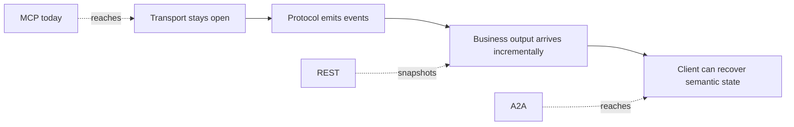
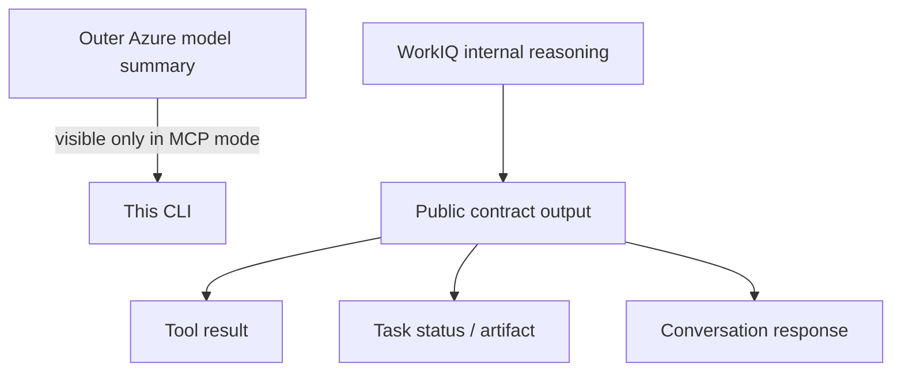

# Control, state, and streams

MCP, A2A, and REST are not interchangeable transports around one WorkIQ API. Each contract moves
the agent loop, durable state, and recovery boundary to a different component.

!!! tip "Ask this first"
    **Who should own the orchestration?** That answer eliminates more ambiguity than comparing
    endpoint shapes or whether a transport uses JSON-RPC, HTTP, or SSE.

## Where the agent loop runs

=== "MCP - application-owned"

    ```mermaid
    sequenceDiagram
        actor U as User
        participant C as Application
        participant G as Outer model
        participant M as WorkIQ MCP
        participant D as Microsoft 365

        U->>C: Natural-language request
        C->>G: Prompt + tool schemas
        G-->>C: Tool call
        C->>M: tools/call
        M->>D: Permission-trimmed operation
        D-->>M: Data or operation result
        M-->>C: Tool result
        C->>G: Continue the agent loop
        G-->>U: Application-composed answer
    ```

    The application selects the model, exposes approved tools, manages retries and state, and
    composes the final answer. WorkIQ is a tool provider. This is the architecture implemented in
    this repository. [[R1]](evidence.md#r1) [[R2]](evidence.md#r2)

=== "A2A - delegated task"

    ```mermaid
    sequenceDiagram
        actor U as User
        participant C as Caller or outer agent
        participant W as WorkIQ A2A agent
        participant D as Microsoft 365

        U->>C: Outcome-oriented request
        C->>W: SendStreamingMessage
        W-->>C: Task working
        W->>D: Internal retrieval + synthesis
        W-->>C: Status updates
        W-->>C: Artifact updates
        W-->>C: Task completed
        C-->>U: Render answer artifact
    ```

    The caller delegates an outcome. WorkIQ owns internal retrieval and synthesis, while the caller
    tracks the public task contract. [[S5]](evidence.md#s5) [[P2]](evidence.md#p2)

=== "REST - delegated turn"

    ```mermaid
    sequenceDiagram
        actor U as User
        participant C as Application
        participant R as WorkIQ REST Chat
        participant D as Microsoft 365 + web

        U->>C: Chat message
        C->>R: POST chatOverStream
        R->>D: Grounding + synthesis
        R-->>C: Conversation snapshots
        R-->>C: Final snapshot
        C-->>U: Render response + citations
    ```

    The application submits one conversational turn and reconciles the resulting conversation. It
    does not run an external model or tool loop. [[S7]](evidence.md#s7)
    [[S8]](evidence.md#s8)

## Capability matrix

| Capability | MCP | A2A | REST Chat |
| --- | --- | --- | --- |
| Primary abstraction | Tool call | Agent message / task | Conversation / turn |
| Orchestration owner | Caller | WorkIQ agent | WorkIQ |
| Granular entity reads | **Yes** | Not a public primitive | Not a public primitive |
| Create, update, delete, actions | **Yes**, policy controlled | Agent-dependent | Unsupported |
| Runtime schema discovery | **Yes** | Agent Card only | No |
| Conversation identity | Outer graph + optional WorkIQ `conversationId` | `contextId` | `conversationId` |
| Durable task identity | No WorkIQ task object | **`task.id`** | No task object |
| Stream unit | Model events around atomic tool results | Status + artifact events | Conversation snapshots |
| Cancellation | Implementation-dependent tool request | **`CancelTask`** | Abort the HTTP stream |
| Reconnect | Application-owned | **`GetTask` / `SubscribeToTask`** | Continue the conversation |
| External model required | **Yes** for agentic use | No | No |
| Caller-controlled writes | **Yes**, with policy | Do not assume | No |

The table describes the currently published WorkIQ contracts, not every capability allowed by the
underlying protocols. [[S1]](evidence.md#s1) [[S5]](evidence.md#s5)
[[S7]](evidence.md#s7)

## Streaming has three different meanings



### MCP: connected does not mean incremental

MCP supports stdio, Streamable HTTP, progress notifications, and cancellation. A server still has
to emit progress for a request, and a client has to request and render it. The published WorkIQ
`ask` contract describes a completed `TextContent` result, not partial answer events.
[[P1]](evidence.md#p1) [[S2]](evidence.md#s2)

**Architectural inference:** the current CLI can show tool start, elapsed time, and tool end, but it
cannot reveal incremental WorkIQ answer text during one `ask` call. WorkIQ could add MCP progress
later without changing protocols.

### A2A: semantic task events

A2A SSE can distinguish status changes from artifact updates and associate both with a task. Its
artifact contract also defines append/replacement and final-chunk behavior. This supports stateful
reconstruction, not just progressive display. [[P2]](evidence.md#p2)

### REST: evolving conversation snapshots

`chatOverStream` returns a sequence of `copilotConversation` resources. Events can repeat messages
or contain no messages, so clients reconcile by message ID rather than append every payload as a
token delta. [[S8]](evidence.md#s8)

## Reasoning boundary

None of the contracts promises private chain-of-thought.



In MCP mode, this repository can render a supported reasoning **summary** from its outer Azure
model. That is separate from WorkIQ's internal reasoning and is not private chain-of-thought.
[[R2]](evidence.md#r2) [[R3]](evidence.md#r3)

## State inventory

| State | Owner | Persistence decision |
| --- | --- | --- |
| Deep Agent messages and checkpoints | MCP application | Persist by application thread |
| WorkIQ MCP `conversationId` | WorkIQ `ask` + caller | Persist by tenant and user only when intentional continuation is required |
| A2A `contextId` | WorkIQ A2A | Group related tasks/messages by tenant and user |
| A2A `task.id` | WorkIQ A2A | Persist for status, cancellation, and recovery |
| REST `conversationId` | WorkIQ REST | Persist for subsequent turns by tenant and user |
| HTTP/MCP transport session | Transport | Never treat as conversation history |

The most subtle case is MCP: an outer Deep Agent thread can contain an inner WorkIQ `ask`
conversation. Reusing its `conversationId` adds WorkIQ-side context that may not be visible in the
outer transcript. [[S2]](evidence.md#s2)