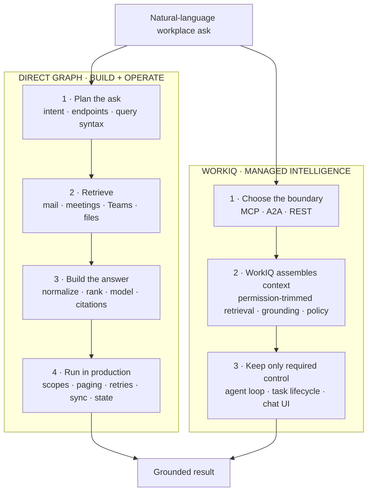

# WorkIQ vs Microsoft Graph

Microsoft Graph is a resource API, not an answer engine. It is excellent when the application needs
deterministic entities and mutations. For a natural-language ask spanning mail, meetings, Teams, and
files, the application must turn those resources into an answer. WorkIQ supplies that intelligence
layer through MCP, A2A, or REST.

## Executive architecture view

**Executive takeaway:** WorkIQ reduces the custom build and operating surface for grounded workplace
answers. Direct Graph maximizes control, but the application funds and owns the answer pipeline.

**Architect takeaway:** Both enforce user permissions. The boundary is who owns intent decomposition,
cross-workload retrieval, synthesis, and lifecycle—not who can bypass Microsoft 365 governance.

## Where direct Graph adds work

| Concern | Direct Microsoft Graph | WorkIQ |
| --- | --- | --- |
| Query planning | Select endpoints, entity types, OData or KQL, fields, and date windows. | REST and A2A accept the ask; an MCP agent selects generic tools and paths. |
| Cross-workload retrieval | Use workload endpoints or supported Search API entity combinations, then normalize, deduplicate, and rank results. | WorkIQ assembles permission-trimmed work context across supported sources. |
| Permissions | Request the least-privileged scope for every workload and operation. | Use delegated WorkIQ permissions plus tenant and path policy. |
| Reliability | Implement paging, `429`/`503` backoff, partial batch retries, and workload-specific errors. | REST and A2A avoid retrieval fan-out; with MCP, the caller still owns the tool loop but not workload-specific clients. |
| Synthesis | Choose a model, constrain context, produce citations, and evaluate answer quality. | REST and A2A return synthesized output; MCP leaves final synthesis to the outer model. |
| Persistent data | If local state is required, operate change notifications, delta tokens, retention, and deletion. | Typical grounded asks use Microsoft 365's existing index without copying workplace data. |

These are disadvantages only when the product requirement is **an answer**. Graph remains the
stronger primitive when the requirement is an exact payload, a stable CRUD workflow, app-only
execution, or independent control over storage and models.

## Effort by example

The labels compare production integration surface, not elapsed developer time.

| Ask | Direct Graph implementation | WorkIQ route | Relative effort |
| --- | --- | --- | --- |
| "What meetings do I have today?" | Query `calendarView`, handle time zones, recurrence, fields, and paging. | One REST turn or A2A message with required location metadata. | **Low / low.** Prefer Graph for structured events; WorkIQ for a prose answer. |
| "Brief me for my Contoso call." | Search mail, Teams, files, and events with separate scopes and requests; fetch details; merge, rank, and summarize. | Create a REST conversation and submit the ask. | **High / low-medium.** |
| "Summarize project risks and correlate them with incident telemetry." | Build Microsoft 365 retrieval, an external telemetry integration, and a model/tool loop. | Give an outer agent WorkIQ MCP and telemetry tools. | **High / medium.** |
| "Investigate the regression; let me cancel and reconnect later." | Add retrieval and synthesis plus a job queue, state store, status API, cancellation, and artifact persistence. | Send an A2A task; persist `task.id` and `contextId`; get, subscribe, or cancel while retained. | **Very high / medium.** |
| "Create this exact approved calendar event." | Call the calendar endpoint with a narrow schema and explicit authorization. | Use an approval-gated MCP `create_entity` call. | **Low / medium.** Graph is usually the cleaner contract. |

The second row is the important dividing line. The
[Microsoft Search API](https://learn.microsoft.com/graph/api/resources/search-api-overview?view=graph-rest-1.0)
provides permission-trimmed hits, but mail, events, Teams messages, and files have different scopes,
result shapes, paging limits, and supported combinations. Search does not perform the final
cross-source synthesis.

## Production implications

- Graph clients must always account for paging and throttling; Microsoft documents `@odata.nextLink`,
  `Retry-After`, and separate retry handling for throttled batch members.
- A locally maintained Graph corpus also needs change notifications and delta queries, including
  token expiry and resynchronization behavior.
- WorkIQ reduces that retrieval and synthesis surface, but it is delegated-only, usage billed, and
  AI-generated output still requires verification. REST has no writes or long-running task contract.
- Both approaches enforce the signed-in user's access. WorkIQ does not grant access to content the
  user cannot already reach.

## Microsoft Learn references

- [Work IQ API overview](https://learn.microsoft.com/microsoft-365/copilot/extensibility/work-iq/api-overview)
- [Work IQ MCP overview](https://learn.microsoft.com/microsoft-365/copilot/extensibility/work-iq/mcp/overview)
- [Work IQ A2A overview](https://learn.microsoft.com/microsoft-365/copilot/extensibility/work-iq/a2a/overview)
- [Work IQ REST overview](https://learn.microsoft.com/microsoft-365/copilot/extensibility/work-iq/rest/overview)
- [Microsoft Search API query guidance](https://learn.microsoft.com/graph/api/resources/search-api-overview?view=graph-rest-1.0)
- [Microsoft Graph best practices](https://learn.microsoft.com/graph/best-practices-concept)
- [Microsoft Graph delta query](https://learn.microsoft.com/graph/delta-query-overview)