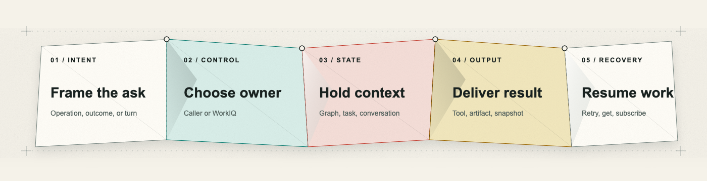

<section class="field-hero" markdown>

# Three protocols. Three control boundaries.

WorkIQ exposes **MCP**, **A2A**, and **REST**. They reach similar Microsoft 365 context, but
they assign orchestration, state, and recovery to different owners.

[Choose a protocol](#choose-by-ownership){ .md-button .md-button--primary }
[Control model](foundations.md){ .md-button }

<picture class="fold-figure">
  <source media="(max-width: 600px)" srcset="assets/images/fold-sequence-mobile.png">
  
</picture>

</section>

  

    IntentControlStateOutputRecovery
  

  

    <strong>MCP</strong>Ask / operationMCP hostHost + optional WorkIQ chatAnswer / resultMCP host
  

  

    <strong>A2A</strong>OutcomeWorkIQ agentTask + contextArtifactsGet / subscribe
  

  

    <strong>REST</strong>Chat turnWorkIQConversationResponseContinue turn
  

## Choose by ownership

  <a class="protocol-row protocol-row--mcp" href="protocols/mcp/">
    MCP
    <strong>You own the loop.</strong> Let an LLM-based client call WorkIQ <code>ask</code> for a synthesized answer or compose entity, schema, and action tools.
    Inspect MCP
  </a>
  <a class="protocol-row protocol-row--a2a" href="protocols/a2a/">
    A2A
    <strong>You delegate the outcome.</strong> Track WorkIQ-owned work through task status, artifacts, cancellation, and subscription.
    Inspect A2A
  </a>
  <a class="protocol-row protocol-row--rest" href="protocols/rest/">
    REST
    <strong>You submit a turn.</strong> Embed a synthesized Microsoft 365 Copilot conversation.
    Inspect REST
  </a>

## Sixty-second decision

Question complexity does not choose the protocol. The same complex Microsoft 365 question can be
submitted through MCP `ask`, A2A `SendMessage`, or REST chat. Start with the caller and the contract
the application needs; these are recommendations, not capability boundaries.

| If the architecture starts with... | Start with | Contract you gain |
| --- | --- | --- |
| "My LLM-based client should invoke WorkIQ as a tool" | **MCP** | Synthesized `ask` responses or composable operations inside a caller-owned loop |
| "My agent should delegate work and manage it as a task" | **A2A** | Task identity, status, artifacts, cancellation, and subscription |
| "My app or backend needs a direct Copilot conversation API" | **REST** | Multiturn synthesized chat without an MCP host or task lifecycle |

!!! warning "Reasoning boundary"
    None of the three WorkIQ contracts promises private chain-of-thought. The CLI can show the
    supported reasoning summary from its **outer Azure model** in MCP mode; WorkIQ itself exposes
    public tool results, task events, artifacts, or conversation responses.