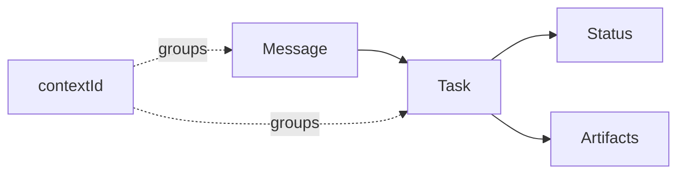

# A2A - Delegate a task

Use A2A when WorkIQ should execute an outcome and the caller needs a task contract.

<div class="fold-board">
  <div class="fold-track fold-track--header" aria-hidden="true">
    <span></span><span>Intent</span><span>Control</span><span>State</span><span>Output</span><span>Recovery</span>
  </div>
  <div class="fold-track fold-track--a2a">
    <strong>A2A</strong><span>Outcome</span><span>WorkIQ agent</span><span>Task + context</span><span>Artifacts</span><span>Get / cancel</span>
  </div>
</div>

## Contract

```text
Endpoint    https://workiq.svc.cloud.microsoft/a2a/
Agent Card  https://workiq.svc.cloud.microsoft/a2a/.well-known/agent-card.json
```

WorkIQ supports A2A v1.0 and v0.3. Send `A2A-Version`; omission selects v0.3. Read the deployed
Agent Card rather than hard-coding agent capabilities.



| Object | Meaning |
| --- | --- |
| Message | User or agent communication |
| Task | Stateful delegated work with an ID and lifecycle |
| Artifact | Public task output |
| `contextId` | Grouping for related messages and tasks |

These objects expose collaboration state, not WorkIQ's internal retrieval plan or private
reasoning.

## Lifecycle

| Method | Purpose |
| --- | --- |
| `SendMessage` | Submit an outcome-oriented request |
| `GetTask` | Read the latest task state |
| `CancelTask` | Request cancellation |
| `SubscribeToTask` | Observe subsequent task updates |

Persist `task.id` and `contextId` by tenant and user. Recovery means reading a task while WorkIQ
retains it; the published contract does not promise archival retention.

## Authentication

A2A requires a delegated WorkIQ token:

```text
Audience  api://workiq.svc.cloud.microsoft
Scope     api://workiq.svc.cloud.microsoft/WorkIQAgent.Ask
```

Use PKCE for local public clients and OBO for hosted confidential clients. The Agent Card and every
task operation still require authorization; task and context IDs are not capabilities.

[Delegated authentication details](../authentication.md)

## Concrete applications

| Application | Example delegation | Why A2A |
| --- | --- | --- |
| Operations coordinator | "Investigate the launch regression and report the likely causes." | The coordinator can track, cancel, or reconnect to a retained task. |
| Meeting-preparation worker | "Build a briefing for tomorrow's executive review." | The caller consumes a completed artifact instead of controlling retrieval. |
| Multi-agent service desk | "Resolve this request using the employee's work context." | A router can discover WorkIQ through its Agent Card and hand off the outcome. |

## Choose A2A for

- outcome delegation to a WorkIQ agent;
- explicit task status, cancellation, and recovery within service retention;
- artifacts rather than raw Microsoft 365 resources;
- a multi-agent system that discovers peers through Agent Cards.

Use REST for plain conversation. Use MCP when the caller must choose operations or perform writes.
