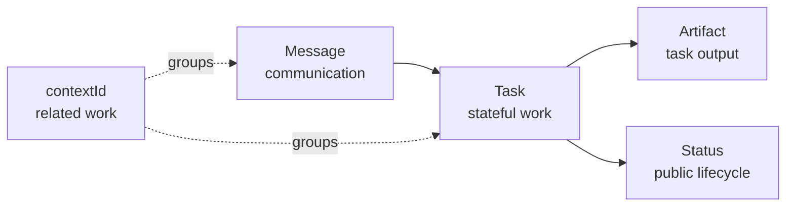
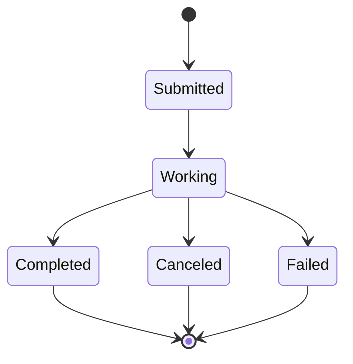

# A2A - Delegate a task

Use Agent2Agent Protocol when WorkIQ should own retrieval and synthesis while your application owns
task initiation, status, cancellation, and recovery.

<div class="fold-board">
  <div class="fold-track fold-track--header" aria-hidden="true">
    <span></span><span>Intent</span><span>Control</span><span>State</span><span>Output</span><span>Recovery</span>
  </div>
  <div class="fold-track fold-track--a2a">
    <strong>A2A</strong><span>Outcome</span><span>WorkIQ agent</span><span>Task + context</span><span>Artifacts</span><span>Get / subscribe</span>
  </div>
</div>

!!! success "Best fit"
    Outcome-oriented delegation that needs explicit task identity, public status, artifacts,
    cancellation, resubscription, or recovery after a disconnected stream.

## Discovery and versioning

WorkIQ supports A2A v1.0 and v0.3. Select a version with the `A2A-Version` header; omission defaults
to v0.3. [[S5]](../evidence.md#s5) [[S6]](../evidence.md#s6)

```text
Endpoint    https://workiq.svc.cloud.microsoft/a2a/
Agent Card  https://workiq.svc.cloud.microsoft/a2a/.well-known/agent-card.json
```

The published Agent Card advertises text input/output and `streaming: true`. Read the deployed card
at runtime rather than assuming every environment has the same capabilities.

## Message, task, context, artifact



- A **Message** carries user or agent communication.
- A **Task** gives stateful work an ID and status.
- An **Artifact** carries task output.
- A **`contextId`** groups related messages and tasks into a multi-turn context.

These are public collaboration objects. They do not expose WorkIQ's internal retrieval loop or
private reasoning. [[P2]](../evidence.md#p2)

## Synchronous wire contract

```http
POST https://workiq.svc.cloud.microsoft/a2a/
Authorization: Bearer <token>
Content-Type: application/json
A2A-Version: 1.0
```

```json
{
  "jsonrpc": "2.0",
  "id": "<request-guid>",
  "method": "SendMessage",
  "params": {
    "message": {
      "role": "ROLE_USER",
      "messageId": "<message-guid>",
      "parts": [
        { "text": "What meetings do I have today?" }
      ],
      "metadata": {
        "Location": {
          "timeZoneOffset": -480,
          "timeZone": "America/Los_Angeles"
        }
      }
    }
  }
}
```

The response contains a task with status, `contextId`, and answer artifact.
[[S5]](../evidence.md#s5) [[S6]](../evidence.md#s6)

## Streaming is semantic

`SendStreamingMessage` returns SSE events that a client can interpret by role, not just bytes:

```text
data: {"task":{"id":"task-uuid","status":{"state":"TASK_STATE_WORKING"}}}

data: {"artifactUpdate":{"taskId":"task-uuid","artifact":{"parts":[{"text":"Partial answer"}]}}}

data: {"statusUpdate":{"taskId":"task-uuid","status":{"state":"TASK_STATE_COMPLETED"}}}
```

The caller can distinguish status from output and associate every event with a task. Public status
messages may explain activity, but they are not chain-of-thought. [[P2]](../evidence.md#p2)

## Reconstruct artifacts correctly

A `TaskArtifactUpdateEvent` identifies an artifact and carries append plus final-chunk semantics.

1. Store artifact state by `(taskId, artifactId)`.
2. If `append` is true, append incoming parts to the existing artifact.
3. If `append` is false or absent, apply replacement/new-artifact behavior for the negotiated
   protocol version.
4. Treat `lastChunk` or `last_chunk` as the final chunk for that artifact, independently of task
   terminal status.
5. Verify exact JSON field casing against the selected `A2A-Version`.

Never infer append behavior from whether text *looks* partial. [[P2]](../evidence.md#p2)

## Task lifecycle

WorkIQ documents five relevant methods. [[S5]](../evidence.md#s5)

| Method | Caller intent | Durable value |
| --- | --- | --- |
| `SendMessage` | Submit and wait for a response | Task/result contract |
| `SendStreamingMessage` | Submit and receive SSE updates | Status + artifact stream |
| `GetTask` | Read latest known task state | Recovery after disconnect |
| `CancelTask` | Request cancellation | Explicit task control |
| `SubscribeToTask` | Attach to updates | Resubscription |



Persist `task.id` and `contextId` by tenant and user. Do not infer unlimited durability: server-side
retention remains a WorkIQ product contract that must be verified for the deployed version.

## Authentication

A2A uses delegated Entra authentication. [[S5]](../evidence.md#s5)

| Property | Direct WorkIQ value |
| --- | --- |
| Resource / audience | `api://workiq.svc.cloud.microsoft` |
| Delegated scope | `WorkIQAgent.Ask` |
| Admin consent | Required |
| Listed app-only equivalent | None |
| Local caller | Public client + interactive browser / WAM |
| Hosted caller | Confidential client + OBO |

Send the bearer token for Agent Card discovery and A2A requests. `contextId` and `task.id` are state
identifiers, not credentials; every later operation still requires authorization.

[See public-client and OBO flows](../authentication.md)

## Use A2A when

- the caller is an agent or orchestrator delegating an outcome;
- WorkIQ should own internal retrieval and answer synthesis;
- task status, cancellation, resubscription, or recovery matters;
- the caller needs artifacts rather than raw Microsoft Graph entities;
- Agent Cards or agent IDs select among WorkIQ agents.

Do not choose A2A only because it streams. Choose it when the **task abstraction** is valuable. A
plain chat experience has a smaller contract in REST.