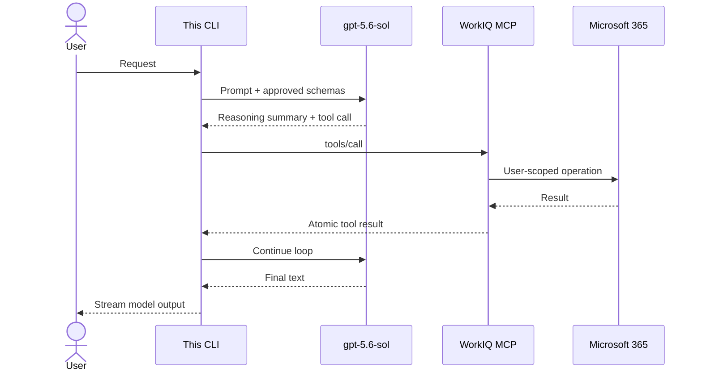
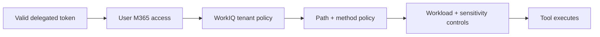

# MCP - Own the loop

Use Model Context Protocol when your application must control orchestration, tool policy, model
choice, and final synthesis. WorkIQ exposes composable operations; your model decides how to use
them.

<div class="fold-board">
  <div class="fold-track fold-track--header" aria-hidden="true">
    <span></span><span>Intent</span><span>Control</span><span>State</span><span>Output</span><span>Recovery</span>
  </div>
  <div class="fold-track fold-track--mcp">
    <strong>MCP</strong><span>Operation</span><span>Your app</span><span>Outer graph</span><span>Tool result</span><span>Your app</span>
  </div>
</div>

!!! success "Best fit"
    Granular reads, schema discovery, controlled writes, cross-provider orchestration, and any
    workflow where an application-owned model must remain in charge.

## The public surface

The current detailed WorkIQ MCP reference lists eleven generic tools. [[S2]](../evidence.md#s2)

| Category | Tools | Semantics |
| --- | --- | --- |
| Entity | `fetch`, `fetch_blob`, `create_entity`, `update_entity`, `delete_entity`, `do_action`, `call_function` | Operate on relative Microsoft 365 resource paths |
| Copilot | `ask`, `list_agents` | Invoke a WorkIQ/Microsoft 365 Copilot agent and discover agents |
| Schema | `get_schema`, `search_paths` | Discover paths and retrieve operation schemas |

The overview still describes "10 tools," while the detailed reference includes `fetch_blob`,
bringing its list to eleven. Treat runtime `tools/list` as authoritative instead of hard-coding a
count. [[S1]](../evidence.md#s1) [[S2]](../evidence.md#s2)

!!! note "Current repository policy"
    WorkIQ exposes `fetch_blob`, but this CLI's read-only allowlist currently omits it. Binary
    retrieval remains unavailable until local policy and Base64 payload handling are deliberately
    reviewed. WorkIQ tenant checks still apply after local allowlisting.
    [[R4]](../evidence.md#r4)

## One verb, many resource paths

The tool is the verb; the relative path is the object:

```text
fetch /me/messages
fetch /me/events
create_entity /me/events
do_action /me/sendMail
call_function /search/query
```

This path-oriented design lets workloads add resources without requiring a new tool definition for
every endpoint. [[S1]](../evidence.md#s1) [[S3]](../evidence.md#s3)

## Wire contract

MCP uses JSON-RPC. A representative entity request is:

```json
{
  "jsonrpc": "2.0",
  "id": 42,
  "method": "tools/call",
  "params": {
    "name": "fetch",
    "arguments": {
      "entityUrls": [
        "/me/messages?$select=id,subject,receivedDateTime&$top=10"
      ]
    }
  }
}
```

WorkIQ returns MCP content and/or structured content. The outer model consumes that result and
chooses whether to call another tool or answer the user. [[S2]](../evidence.md#s2)



## Streaming boundary

MCP itself supports stdio, Streamable HTTP, progress notifications, and cancellation. That does not
make every tool result incremental. A server must emit progress for a request, and its client must
request and process those notifications. [[P1]](../evidence.md#p1)

The published WorkIQ `ask` result is completion-oriented `TextContent`; it does not document
partial answer or reasoning events. [[S2]](../evidence.md#s2)

> **Architectural inference:** this CLI can render tool start, a spinner, elapsed time, and tool end,
> but cannot display incremental WorkIQ `ask` text during the pending call. That is a current WorkIQ
> contract limitation, not an MCP protocol limitation.

The local stdio child can remain continuously connected while an individual business result stays
atomic. Connection lifetime and operation granularity are separate concerns.

## Two reasoning systems

1. The outer `gpt-5.6-sol` model reasons over the request, selects tools, and composes the final
   response. This CLI can render its supported reasoning summary.
2. WorkIQ `ask` invokes Microsoft 365 Copilot reasoning internally and returns a synthesized answer.

Neither exposes private chain-of-thought. The CLI's `thought>` line belongs to the outer Azure
Responses model, not WorkIQ. [[R2]](../evidence.md#r2) [[R3]](../evidence.md#r3)

## Nested state

MCP is a client/server session protocol, not an agent conversation model. State can exist in two
places:

- The outer Deep Agent owns messages and checkpoints.
- WorkIQ `ask` returns a `conversationId`; passing it to a later call continues WorkIQ-side context.
- Entity tools remain individual request/response operations.
- The transport session is neither conversation.

Choose a deliberate policy for every later `ask`:

=== "Continue WorkIQ context"

    Persist and pass the returned `conversationId` for the same tenant and user.

=== "Start independently"

    Omit `conversationId` so WorkIQ does not carry hidden context into the next request.

Unintentional reuse can introduce context that is absent from the outer agent's visible history.
[[S2]](../evidence.md#s2)

## Authentication modes

### Local stdio

This repository starts:

```text
npx -y @microsoft/workiq [--tenant-id <tenant>] mcp
```

Python communicates with the child over stdio. The WorkIQ CLI owns interactive Entra
authentication and calls WorkIQ as the signed-in user; Python does not receive or forward the
bearer token. [[R1]](../evidence.md#r1) [[R4]](../evidence.md#r4)

Operational consequences:

- token acquisition and caching belong to the WorkIQ CLI;
- stdout is reserved for MCP JSON-RPC and logs belong on stderr;
- the child inherits the local user's process environment;
- local tool allowlisting and server-side tenant policy both apply;
- token-cache format and refresh internals are implementation details.

### Remote HTTP

A compliant remote client discovers protected-resource metadata, identifies the authorization
server, performs OAuth 2.1 authorization, requests a resource-bound token, and presents it to the
MCP server. [[P1]](../evidence.md#p1) WorkIQ says compatible clients discover its Entra
configuration this way. [[S1]](../evidence.md#s1)

!!! warning "Do not overgeneralize the Ask scope"
    `WorkIQAgent.Ask` is documented for direct agent conversations. The cited public reference does
    not prove that this one scope authorizes every entity, schema, binary, and mutation tool.
    Discover applicable scopes from deployed protected-resource metadata and test each operation
    category with the tenant-approved registration.

[See the complete delegated-authentication model](../authentication.md)

## Layered authorization



Mutation operations are blocked by default and require WorkIQ tenant policy. The application should
also require explicit user confirmation before exposing an action to the model.
[[S2]](../evidence.md#s2) [[S4]](../evidence.md#s4)

## Use MCP when

- the application must own orchestration and final synthesis;
- the model combines WorkIQ with other providers or tools;
- deterministic resource-path reads or runtime schema discovery are required;
- create, update, delete, action, or function operations are required;
- approval gates, model reasoning summaries, and model metrics matter.

Avoid relying only on MCP `ask` when the main requirement is visible partial progress during a long
WorkIQ synthesis. The published WorkIQ tool contract does not expose that stream.