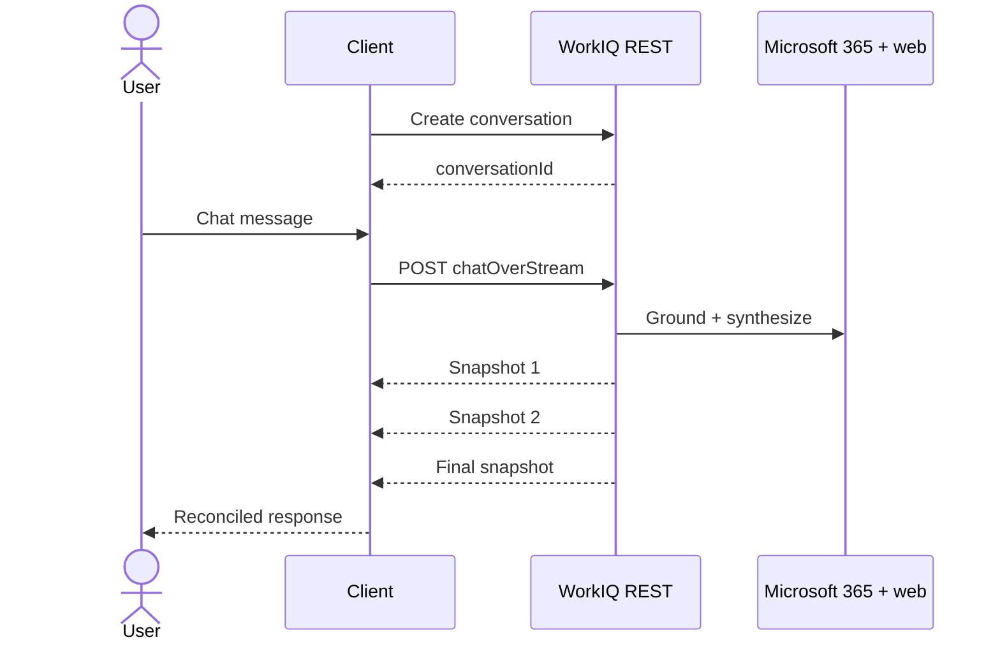

# REST - Delegate a turn

Use the WorkIQ REST Chat API when the product needs a synthesized Microsoft 365 Copilot
conversation without an external model, tool graph, or durable task lifecycle.

<div class="fold-board">
  <div class="fold-track fold-track--header" aria-hidden="true">
    <span></span><span>Intent</span><span>Control</span><span>State</span><span>Output</span><span>Recovery</span>
  </div>
  <div class="fold-track fold-track--rest">
    <strong>REST</strong><span>Chat turn</span><span>WorkIQ</span><span>Conversation</span><span>Snapshots</span><span>Continue turn</span>
  </div>
</div>

!!! success "Best fit"
    The lightest read-only WorkIQ chat: synthesized grounded answers, SSE conversation updates,
    citations, references, and sensitivity metadata with minimal client orchestration.

## Conversation lifecycle

1. Create a conversation.
2. Store its `conversationId` by tenant and user.
3. Send turns through synchronous `chat` or streaming `chatOverStream`.
4. Render answer text and grounding metadata.

The service performs enterprise-search and web-search grounding before returning a synthesized
textual answer. [[S7]](../evidence.md#s7)



## Streaming request

```http
POST https://workiq.svc.cloud.microsoft/rest/conversations/{conversationId}/chatOverStream
Authorization: Bearer <token>
Content-Type: application/json
```

```json
{
  "message": {
    "text": "What meeting do I have at 9 AM tomorrow morning?"
  },
  "locationHint": {
    "timeZone": "America/New_York"
  }
}
```

A successful response uses `Content-Type: text/event-stream`. [[S8]](../evidence.md#s8)

## Snapshots, not token deltas

Each SSE `data` payload contains a `copilotConversation`. Depending on progress and response shape,
it can include:

- conversation state and turn count;
- response message IDs and text;
- adaptive cards;
- references and attributions;
- sensitivity-label metadata.

Intermediate events can repeat messages or provide an empty `messages` collection.
[[S8]](../evidence.md#s8) [[S9]](../evidence.md#s9)

!!! warning "Renderer invariant"
    Maintain the latest resource by message ID. Render only a new suffix or replace the in-progress
    region. Blindly appending every event duplicates text because the stream carries snapshots, not
    OpenAI-style token deltas.

Conceptually:

```python
messages_by_id: dict[str, ResponseMessage] = {}

async for snapshot in stream:
    for message in snapshot.messages:
        previous = messages_by_id.get(message.id)
        messages_by_id[message.id] = message
        render_reconciled(previous, message)
```

The exact production implementation must use the current generated resource types and a robust SSE
parser rather than line splitting.

## Context controls

A turn can include: [[S8]](../evidence.md#s8)

| Control | Purpose | Persistence behavior |
| --- | --- | --- |
| `locationHint` | Time-zone-sensitive grounding | Send when location matters |
| `contextualResources` | OneDrive or SharePoint files | Explicit resources for the request |
| Web-grounding toggle | Disable web grounding | Repeat for every applicable turn |
| `additionalContext` | Application-supplied context | Per request |

Web and enterprise grounding are enabled by default. Disabling web grounding is a single-turn choice,
not a conversation-wide setting. [[S7]](../evidence.md#s7)

## Explicit limits

Microsoft documents these REST Chat boundaries: [[S7]](../evidence.md#s7)

- no action skills such as sending email, creating files, or scheduling meetings;
- no caller-facing granular entity operations;
- no code interpreter or graphic-art tools;
- no background-task or durable-task abstraction;
- long-running turns are prone to gateway timeouts;
- semantic-index limitations still apply;
- generated answers can be inaccurate and require verification.

Generated answer content is textual. Conversation snapshots can additionally contain adaptive
cards, references, attributions, and sensitivity metadata.

Streaming improves perceived latency; it does not turn a conversation into durable background
work. Use A2A when task identity and recovery are required.

## Authentication

Direct REST Chat uses the WorkIQ resource audience and delegated `WorkIQAgent.Ask` permission.
[[S8]](../evidence.md#s8) [[S10]](../evidence.md#s10)

=== "Local CLI"

    Register a public client, acquire a delegated WorkIQ token interactively with PKCE, cache it
    through the identity library, and attach it to create-conversation and chat requests.

=== "Hosted service"

    Authenticate the frontend user, exchange that user assertion through OBO in a confidential
    backend, and call REST with the resulting delegated WorkIQ token.

Do not use client-credentials/app-only authentication unless Microsoft publishes an application
permission for this endpoint. The current reference lists only delegated `WorkIQAgent.Ask`.

[See public-client and OBO flows](../authentication.md)

## Use REST when

- the product is a direct application or CLI chat experience;
- a synthesized Microsoft 365 Copilot answer is the desired output;
- minimal orchestration and infrastructure are preferred;
- conversation snapshots provide sufficient progress;
- references, attributions, and sensitivity metadata should be presented;
- no writes, raw entities, or durable task controls are required.